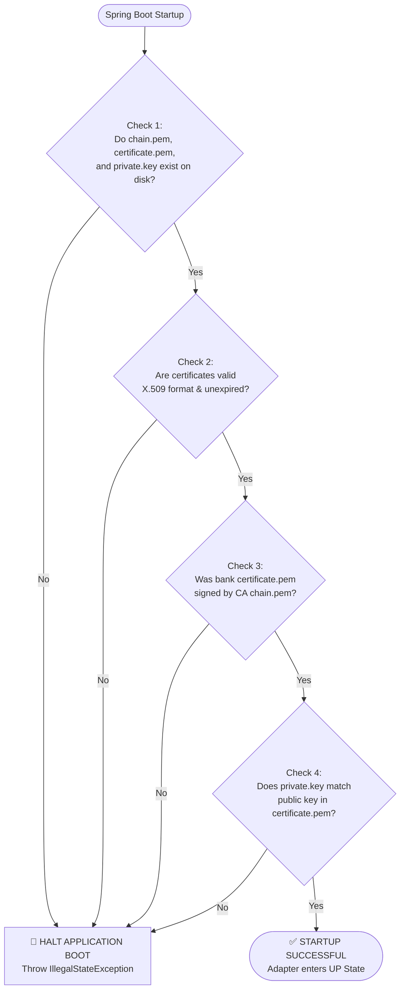

To ensure full security at startup, the **Bank Payment Adapter** requires **3 key cryptographic files** in its `./certs/` directory (or configured path):

---

### 🔑 What the Bank Adapter Needs at Startup:

| File Name | Description | Purpose in the Adapter |
| :--- | :--- | :--- |
| **`chain.pem`** | Central Bank Root CA Certificate | **Trust Anchor**: Used to verify incoming signed ISO 20022 messages from SPS / other banks. |
| **`certificate.pem`** | Bank's X.509 Leaf Certificate | **Identity**: Issued by Central Bank CA (`CN=PMRBSOMM`). Embedded in outgoing XML `<ds:KeyInfo>`. |
| **`private.key`** | Bank's Private Key (RSA) | **Signing**: Used by the adapter to digitally sign outgoing payment requests to SPS. |

---

### 🛡️ The Startup Validation Pipeline (The Boot Check)

When the application starts, the `AdapterStartupValidator` performs **5 automated security checks**:

---

### 📋 Detailed Boot Checks:

1. **Existence Check**: Verifies `chain.pem`, `certificate.pem`, and `private.key` exist on disk.
2. **Validity Check**: Verifies `validFrom <= current_time <= validTo` for both certificates.
3. **CA Trust Verification**: Verifies `certificate.verify(chainPemPublicKey)` to confirm the bank certificate was issued by the Central Bank CA.
4. **Keypair Match Verification**: Signs a dummy byte array with `private.key` and verifies it using the public key in `certificate.pem` to ensure they match!
5. **Strict Enforcement**: If **ANY** check fails, the adapter throws an `IllegalStateException` with clear logs and **fails application startup**.

---

Shall we implement this **Startup Security Validation Pipeline** now?