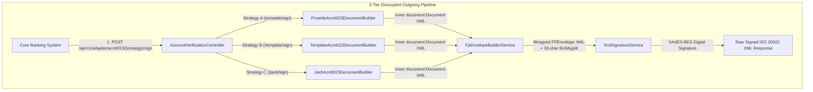

# Bank Payment Adapter Service

An enterprise-grade **Bank Payment Adapter Service** connecting commercial bank Core Banking Systems with the interbank payment network. Built with **Java 24**, **Spring Boot 4**, **BouncyCastle Crypto**, **Prowide ISO 20022 Engine**, **JAXB XML Binding**, and **W3C/ETSI XAdES Security**.

> [!NOTE]
> **Educational & Practice Lab Project**
> This repository is built strictly for educational, research, and practice purposes to demonstrate real-world implementation of **Central Bank PKI Certificate Trust Validation**, **ISO 20022 XML Digital Signatures (XAdES-BES / ETSI TS 101 903)**, and **Core Banking Integration Adapters**.

---

## 🏛️ Architecture & Outgoing Verification Pipeline



---

## 🚀 REST API Strategy Endpoints

The adapter exposes **3 distinct document generation strategies** for creating and signing ISO 20022 `acmt.023.001.03` Account Identification Verification Requests:

| Strategy Endpoint | Engine | Description |
| :--- | :--- | :--- |
| **`POST /api/v1/adapter/acmt023/prowide/sign`** | Prowide SDK (`MxAcmt02300103`) | Uses Prowide ISO 20022 Java SDK object model to construct `<document:Document>`. |
| **`POST /api/v1/adapter/acmt023/template/sign`** | Custom XML Template | Uses optimized XML template string formatting to construct `<document:Document>`. |
| **`POST /api/v1/adapter/acmt023/jaxb/sign`** | JAXB Binding (`jakarta.xml.bind`) | Uses JAXB XML Binding object model with namespace annotations to construct `<document:Document>`. |

### Request Payload (JSON)
```json
{
  "receiverBic": "IBSBSOMM",
  "accountIdentifier": "620050014",
  "identifierType": "MSIS"
}
```

---

## 🔒 XAdES-BES XML Digital Signature Specification

The adapter implements **XAdES-BES (ETSI TS 101 903 v1.3.2)** digital signatures:

1. **Exclusive Canonicalization (`xml-exc-c14n#`)**: Applied across all 3 signed references.
2. **3 Signed Reference Targets**:
   - **Reference 1 (`#keyInfoId`)**: Target KeyInfo URI (`#_{uuid}`).
   - **Reference 2 (`#signedPropsId`)**: Target XAdES SignedProperties URI (`#_{uuid}-signedprops`) with `Type="http://uri.etsi.org/01903/v1.3.2#SignedProperties"`.
   - **Reference 3 (Anonymous Payload)**: Anonymous reference (no `URI` attribute) targeting the inner `<document:Document>` element.
3. **`KeyInfo` Issuer Serial**: Includes `<ds:X509IssuerSerial>` (`X509IssuerName` + `X509SerialNumber`) dynamically parsed from `certificate.pem`.
4. **`<xades:QualifyingProperties>`**: Embedded inside `<ds:Object>` containing `<xades:SignedProperties>` with UTC timestamp `<xades:SigningTime>`.
5. **Single-Line `<ds:SignatureValue>`**: Base64 signature value rendered on a single continuous line.
6. **Unique ID Generators**:
   - **`BizMsgIdr`**: Exactly 33 characters (`8-char BIC + 14-char UTC timestamp + 11-char random alphanumeric ID`).
   - **`MsgId`**: Exactly 31 characters (`8-char BIC + 14-char UTC timestamp + 9-char random alphanumeric ID`).

---

## 🛡️ Startup Cryptographic Guardrails

When the application boots up, `AdapterStartupValidator` executes **4 local in-memory cryptographic checks** without making any external API calls:

1. **File Existence Check**: Resolves `chain.pem`, `certificate.pem`, and `private.pem` in `./certs/`.
2. **X.509 Parsing & Expiration Check**: Parses certificates via BouncyCastle and verifies `validFrom <= current_time <= validTo`.
3. **CA Trust Verification**: Verifies `bankCert.verify(caPublicKey)` to confirm `certificate.pem` was issued by `chain.pem`.
4. **RSA Keypair Match Verification**: Signs an in-memory test payload with `private.pem` (`SHA256withRSA`) and verifies it using `certificate.pem`'s public key.

---

## ⚙️ Configuration Properties (`application.yaml`)

| Property | Default Value | Environment Variable | Description |
| :--- | :--- | :--- | :--- |
| `server.port` | `8081` | `SERVER_PORT` / `PORT` | Application HTTP Server Port |
| `adapter.bank-bic` | `PMRBSOMM` | `BANK_BIC` | Bank's own BIC Code |
| `adapter.certs.dir` | `./certs` | `CERTS_DIR` | Directory containing certificate & key files |
| `adapter.certs.ca-cert-file` | `chain.pem` | `CA_CERT_FILE` | Central Bank Root CA Certificate file name |
| `adapter.certs.bank-cert-file` | `certificate.pem` | `BANK_CERT_FILE` | Commercial Bank Leaf Certificate file name |
| `adapter.certs.private-key-file` | `private.pem` | `PRIVATE_KEY_FILE` | Commercial Bank RSA Private Key file name |
| `adapter.certs.private-key-passphrase` | `""` | `PRIVATE_KEY_PASSPHRASE` | Optional passphrase for encrypted private keys |
| `adapter.certs.strict-startup-check` | `true` | `STRICT_STARTUP_CHECK` | Enforce 4 cryptographic boot checks on startup |
| `adapter.signature.algorithm` | `SHA256withRSA` | `SIGNATURE_ALGORITHM` | Signature Algorithm |
| `adapter.signature.canonicalization` | `EXCLUSIVE` | `CANONICALIZATION_ALGORITHM` | XML Canonicalization Algorithm |
| `adapter.signature.xades-enabled` | `true` | `XADES_ENABLED` | Attach ETSI XAdES-BES qualifying properties |
| `adapter.signature.xades-namespace` | `http://uri.etsi.org/01903/v1.3.2#` | `XADES_NAMESPACE` | XAdES XML Namespace |

---

## 🛠️ Local Development & Test Execution

### Prerequisites
- JDK 24 (OpenJDK 24)
- Maven 3.9+

### Build & Run Tests
```bash
# Navigate to adapter directory
cd iso20022-lab/bank-payment-adapter

# Compile project
./mvnw.cmd clean compile

# Run full test suite (11 unit & integration tests)
./mvnw.cmd clean test

# Run application locally
./mvnw.cmd spring-boot:run
```

---

## 📜 License
Central Bank PKI Lab — All Rights Reserved.