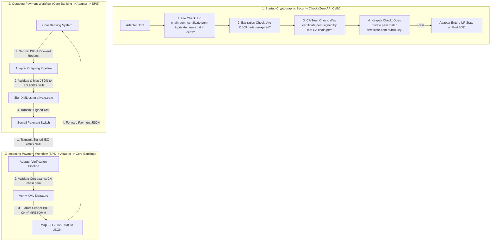

# Somali Payment Switch (SPS) Bank Payment Adapter

An enterprise-grade **Bank Payment Adapter Service** connecting commercial bank Core Banking Systems with the **Somali Payment Switch (SPS)** interbank network. Built with **Java 24**, **Spring Boot 4**, **BouncyCastle Crypto**, and **Apache Santuario XML Security**.

> [!NOTE]
> **Educational & Practice Lab Project**
> This repository is built strictly for educational, research, and practice purposes to demonstrate real-world implementation of **Central Bank PKI Certificate Trust Validation**, **ISO 20022 XML Digital Signatures (W3C xmldsig)**, and **Core Banking Integration Adapters**.

---

## 🏛️ System Architecture & Workflow

The Bank Payment Adapter sits as a secure integration proxy between the commercial bank's internal Core Banking APIs and the Somali Payment Switch (SPS) interbank network.



---

## 🛡️ Startup Cryptographic Guardrails

When the application boots up, `AdapterStartupValidator` executes **4 local in-memory cryptographic checks** without making any external API calls:

1. **File Existence Check**: Resolves `chain.pem`, `certificate.pem`, and `private.pem` in `./certs/`.
2. **X.509 Parsing & Expiration Check**: Parses certificates via BouncyCastle and verifies `validFrom <= current_time <= validTo`.
3. **CA Trust Verification**: Verifies `bankCert.verify(caPublicKey)` to confirm `certificate.pem` was issued by `chain.pem`.
4. **RSA Keypair Match Verification**: Signs an in-memory test payload with `private.pem` (`SHA256withRSA`) and verifies it using `certificate.pem`'s public key.

> [!CAUTION]
> **Strict Boot Failure Enforcement**: If **ANY** check fails or any required certificate file is missing, the validator logs `CRITICAL STARTUP ERROR` and throws an `IllegalStateException`, **halting Spring Boot startup immediately**.

---

## ⚙️ Configuration Properties

| Property | Default Value | Environment Variable | Description |
| :--- | :--- | :--- | :--- |
| `server.port` | `8081` | `SERVER_PORT` | Application HTTP Server Port |
| `adapter.certs.dir` | `./certs` | `CERTS_DIR` | Directory containing certificate and key files |
| `adapter.certs.ca-cert-file` | `chain.pem` | `CA_CERT_FILE` | Central Bank Root CA Certificate file name |
| `adapter.certs.bank-cert-file` | `certificate.pem` | `BANK_CERT_FILE` | Commercial Bank Leaf Certificate file name |
| `adapter.certs.private-key-file` | `private.pem` | `PRIVATE_KEY_FILE` | Commercial Bank RSA Private Key file name |
| `adapter.certs.strict-startup-check` | `true` | `STRICT_STARTUP_CHECK` | Enforce 4 cryptographic boot checks on startup |
| `cors.allowed-origins` | `http://localhost:3000...` | `CORS_ALLOWED_ORIGINS` | Allowed origins for CORS headers |

---

## 🛠️ Local Development & Test Execution

### Prerequisites
- JDK 24 (OpenJDK 24)
- Maven 3.9+

### Build & Run Tests
```bash
# Navigate to adapter directory
cd iso20022-lab/bank-payment-adapter

# Compile and package
./mvnw.cmd clean compile

# Run test suite (includes AdapterStartupValidatorTest)
./mvnw.cmd clean test

# Run application locally
./mvnw.cmd spring-boot:run
```

---

## 📜 License
Central Bank of Somalia PKI Lab — All Rights Reserved.